# STM32H743 移植笔记

> 本项目除了实现基本功能的移植外，还提供了如下功能：

* 集成实时操作系统 (RTOS)（腾讯的 TinyOS)
* 集成 FATFS 文件系统，访问 SD 卡的数据。
* 实现从文件系统加载应用程序的资源。
* 使用 Sqlite 存储数据。
* 支持 google 拼音输入法。
* 支持 mvvm 。

## 1. 介绍

在移植的时候，不管是什么板子，拿到板子的资料后，先找一个带有显示功能的最简示例。以这个最简示例为模板，加入 AWTK 相关代码再进行移植。本文中使用开发板提供的 SD 卡的例子，具体位置在：

```
阿波罗 STM32H743 资料盘 (A 盘）\4，程序源码、2，标准例程-HAL 库版本、实验 42 FATFS 实验
```

> 这是一个 Keil 工程，在移植之前，先确保该工程能够正常编译、下载和运行。

## 2. 将 awtk 项目取到当前目录

* 从 github 上获取源码

```
git clone https://github.com/zlgopen/awtk.git
```

* 确保 awtk 是在当前目录中。

```
drwxr-xr-x 1 Admin 197121     0 5 月   4 21:50 awtk/
drwxr-xr-x 1 Admin 197121     0 5 月   4 19:06 CORE/
```

## 3. 在当前目前创建 awtk-port 子目录

```
drwxr-xr-x 1 Admin 197121     0 5 月   4 21:50 awtk/
drwxr-xr-x 1 Admin 197121     0 5 月   4 21:50 awtk-port/
drwxr-xr-x 1 Admin 197121     0 5 月   4 19:06 CORE/
```

## 4. 创建配置文件 awtk-port/awtk_config.h 

```
-rw-r--r-- 1 Admin 197121 2011 5 月   4 21:50 awtk_config.h
```

在创建配置文件时，以 awtk/src/base/awtk_config_sample.h 为蓝本，并参考类似平台的配置文件：

对于中端平台 (Cortex M4/M7)，典型的配置如下：

```

/**
 * 嵌入式系统有自己的 main 函数时，请定义本宏。
 *
 */
#define USE_GUI_MAIN 1

/**
 * 如果支持 png/jpeg 图片，请定义本宏
 *
 */
#define WITH_STB_IMAGE 1

/**
 * 如果支持 Truetype 字体，请定义本宏
 *
 */
#define WITH_STB_FONT 1

/**
 * 如果定义本宏，使用标准的 UNICODE 换行算法，除非资源极为有限，请定义本宏。
 *
 */
#define WITH_UNICODE_BREAK 1

/**
 * 如果定义本宏，将图片解码成 BGRA8888 格式，否则解码成 RGBA8888 的格式。
 *
 */
#define WITH_BITMAP_BGRA 1

/**
 * 如果定义本宏，将不透明的 PNG 图片解码成 BGR565 格式，建议定义。
 *
 */
#define WITH_BITMAP_BGR565 1

/**
 * 如果 FLASH 空间较小，不足以放大字体文件时，请定义本宏
 *
 */
#define WITH_MINI_FONT 1

/**
 * 如果启用 STM32 G2D 硬件加速，请定义本宏
 *
 */
#define WITH_STM32_G2D 1

/**
 * 如果启用 VGCANVAS，而且没有 OpenGL 硬件加速，请定义本宏
 *
 */
#define WITH_NANOVG_AGGE 1

/**
 * 如果启用 VGCANVAS，请定义本宏
 *
 */
#define WITH_VGCANVAS 1

/**
 * 如果启用竖屏，请定义本宏
 *
 */
//#define WITH_LCD_PORTRAIT 1

/**
 * 启用输入法，但不想启用联想功能，请定义本宏。
 *
 */
#define WITHOUT_SUGGEST_WORDS 1

#define WITH_IME_NULL 1
```

> 在支持文件系统之前不要开启输入法，否则可能因为空间不够而编译失败。

## 5. 加入 AWTK 的源文件

AWTK 的源文件很多，而且不同的平台，加入的文件有所不同，导致加文件的过程非常痛苦。为此，我把 cortex m4/m7 需要的文件，放到 files/files_m47.txt 文件中，并本生成 keil 需要的 xml 格式，放到 files/files_m47.xml 中。自己创建项目时，把 files/files_m47.xml 中的内容放到 USER/awtk.uvprojx 即可。

如果不知道放到 USER/awtk.uvprojx 中哪个位置，可以先在 keil 中创建一个 Group，名为 awtk，并添加一个 foobar.c 的文件：

> 在 foobar.c 中随便写点内容，如注释之类的东西。

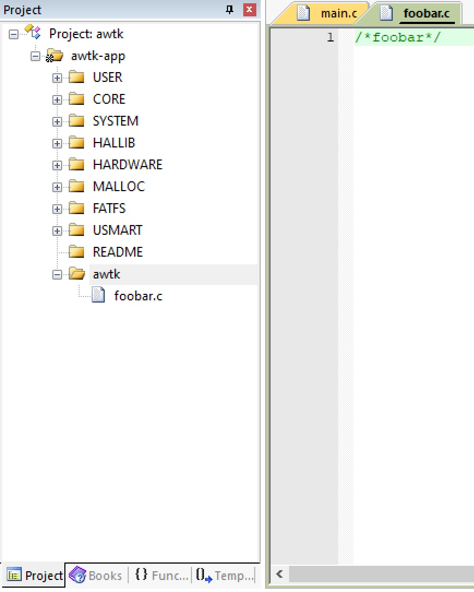

保存并关闭项目，用 notepad++等编辑器打开 USER/awtk.uvprojx，找到 foobar.c 的位置：

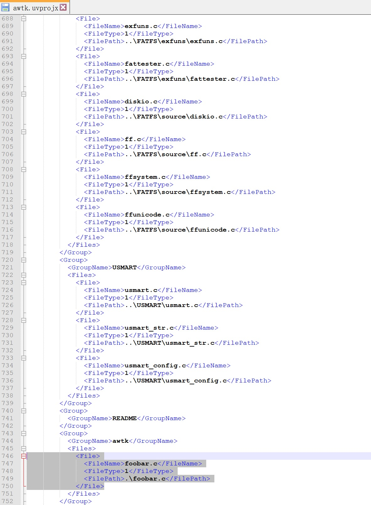

用 files/files_m47.xml 中的内容替换选中部分的内容，保存文件并退出。

> 如果 awtk.uvprojx 文件不是在 Project（或其它名字）子目录下，而是项目根目录下（和 awtk 并列），则需要编辑 files/files_m47.xml，把 ..\awtk 替换成 .\awtk。

用 keil 重新打开工程文件 awtk.uvprojx，我们可以看到文件已经加入：

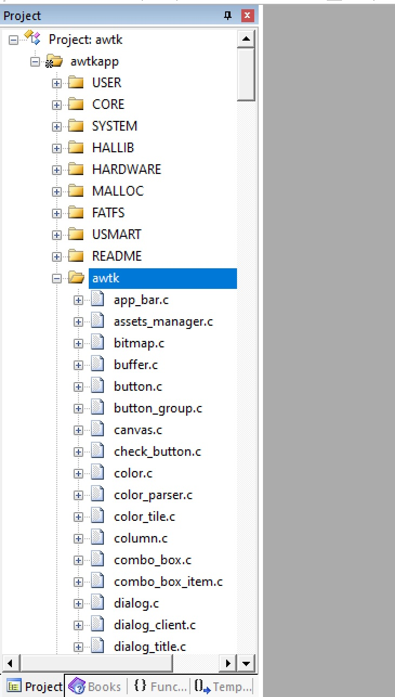

## 6. 配置 keil 工程

* 定义宏 HAS\_AWTK\_CONFIG

  > HAS\_AWTK\_CONFIG 的功能是让 awtk_config.h 生效，所以必须放在 IDE 中定义，而其它用于配置的宏则放在 awtk_config.h 中。

* 增加头文件路径

```
..\awtk\src\ext_widgets;..\awtk;..\awtk\src;..\awtk\3rd;..\awtk\3rd\nanovg\base;..\awtk\3rd\nanovg;..\awtk\3rd\agge;..\awtk\3rd\libunibreak;..\awtk\3rd\gpinyin\include;..\awtk-port
```
* Misc Controls 中加上--gnu 标志。

* 不要勾选 c99，否则 C++编译不了。

设置界面的效果如下：

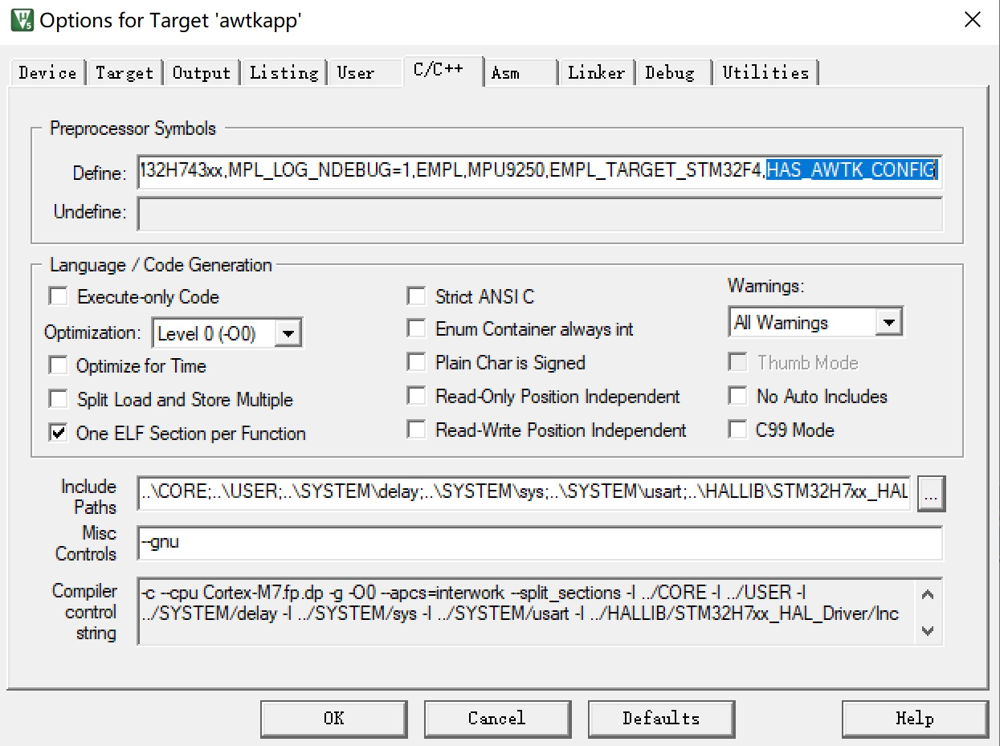

修改 stm32h7xx_it.c，去掉 SysTick_Handler 的定义。

```c
#if 0
/**
  * @brief  This function handles SysTick Handler.
  * @param  None
  * @retval None
  */
void SysTick_Handler(void)
{
  HAL_IncTick();
  
}
#endif
```

## 7. 加入硬件平台相关的文件

编译一下，可以发现，编译没有问题，但是链接时有几个函数找不到。

```
linking...
..\OBJ\Template.axf: Error: L6218E: Undefined symbol sleep_ms (referred from main_loop.o).
..\OBJ\Template.axf: Error: L6218E: Undefined symbol main_loop_init (referred from awtk_global.o).
..\OBJ\Template.axf: Error: L6218E: Undefined symbol platform_prepare (referred from awtk_global.o).
..\OBJ\Template.axf: Error: L6218E: Undefined symbol get_time_ms64 (referred from time_now.o).
Not enough information to list image symbols.
Not enough information to list load addresses in the image map.
Finished: 2 information, 0 warning and 4 error messages.
"..\OBJ\Template.axf" - 4 Error(s), 0 Warning(s).
Target not created.
Build Time Elapsed:  00:00:09
```

现在我们在 awtk-port 目录中，加入以下几个文件。

后面写的硬件平台相关的代码，都会放到下面的文件中。这里先把框架写好，后面再来完善：

```
assert.c   lcd_impl.c  main_loop_impl.c  platform.c  sys_tick.c
```

### 7.1. assert.c 

开始移植的时，经常出现 assert，缺省 assert 的实现，触发 assert 时不知道 assert 的位置。为此我们可以自己实现一个 assert 函数，以方便调试时定位：

```c
#include "tkc/types_def.h"

__attribute__((weak, noreturn)) void __aeabi_assert(const char* expr, const char* file, int line) {
  for (;;)
    ;
}
```

### 7.2. lcd_impl.c

lcd_impl.c 用于实现 lcd 接口，m4/m7 内存都比较大，通常使用 double framebuffer，我们先把框架实现好，后面根据平台实际情况进行完善

```c
#include "base/lcd.h"
#include "tkc/mem.h"
#include "lcd/lcd_mem_bgr565.h"
#include "lcd/lcd_mem_bgra8888.h"

static uint8_t* s_framebuffers[2];

lcd_t* lcd_impl_create(wh_t w, wh_t h) {
  lcd_t* lcd = NULL;

  
#if LCD_PIXFORMAT==LCD_PIXFORMAT_ARGB8888
  lcd = lcd_mem_bgra8888_create_double_fb(w, h, s_framebuffers[0], s_framebuffers[1]);
#else
  lcd = lcd_mem_bgr565_create_double_fb(w, h, s_framebuffers[0], s_framebuffers[1]);
#endif /*LCD_PIXFORMAT*/
  
  return lcd;
}
```

### 7.3. main_loop_impl.c

main_loop_impl.c 主要负责各种事件的分发，这里使用 main_loop_raw.inc 来实现具体功能，提供 dispatch_input_events 函数用于读取和分发触屏和按键事件即可。

```c
#include "main_loop/main_loop_simple.h"

uint8_t platform_disaptch_input(main_loop_t* loop) {
  /*TODO*/

  return 0;
}

lcd_t* platform_create_lcd(wh_t w, wh_t h) {
  return NULL;
}

#include "main_loop/main_loop_raw.inc"

```

### 7.4. systick.c

用于启动 systick，提供 OS 调度和时间相关功能。

```c
void sys_tick_init(int SYSCLK)
{
  /*TODO*/
}		
```

### 7.5. platform.c

主要负责 heap 内存的初始化，请根据平台实际情况调整 MEM2_MAX_SIZE 的大小。

在裸系统的平台中，内存主要分为几种用途：

* 栈
* 堆
* 驱动
* 全局变量。

> 请根据具体情况进行分配和调整。

```c
#include "delay.h"
#include "tkc/mem.h"
#include "base/timer.h"
#include "tkc/platform.h"

#define MEM2_MAX_SIZE 8 * 1024 * 1024
#define MEM2_ADDR (uint8_t*)0XC0000000 + 2 * 1024 * 1024

ret_t platform_prepare(void) {
  static bool_t inited = FALSE;
  
  if (!inited) {
    inited = TRUE;
    tk_mem_init(MEM2_ADDR, MEM2_MAX_SIZE);
  }
  
  return RET_OK;
}

```

### 7.6. 将以上文件加入到 keil 工程：

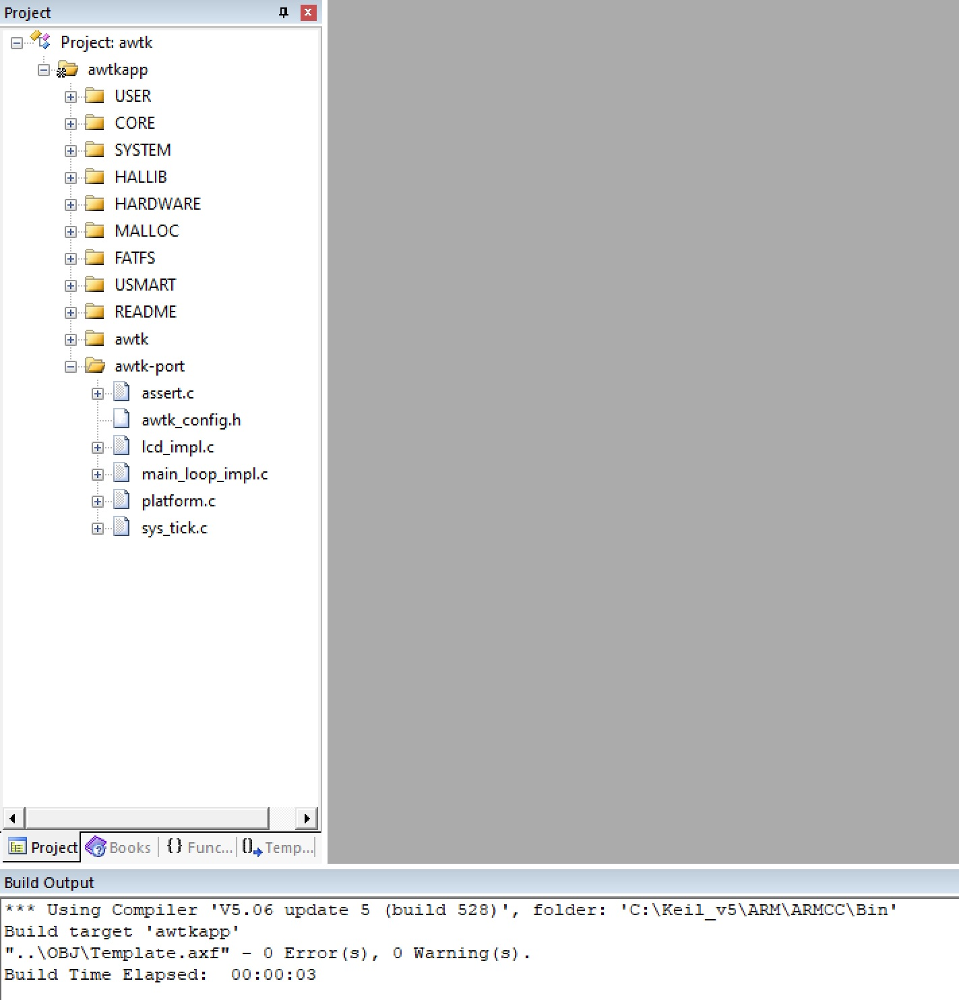

再编译一下，发现编译成功了。当然，只是编译成功而已，并不能真正运行起来，具体移植工作，还有没开始呢。

### 7.7 常见问题

  * 7.7.1 出现 wcsxxx 之类的函数没有定义，请在 awtk_config.h 定义 WITH_WCSXXX。

```c

/**
 * 如果出现 wcsxxx 之类的函数没有定义时，请定义该宏
 *
 * #define WITH_WCSXXX 1
 */
```

## 8. 编写平台相关的代码

### 8.1 实现 lcd

使用 framebuffer 的 lcd 时，首先需要确定 framebuffer 的内存地址，我们可以看看 ltdc.h 里 framebuffer 的定义：

```c
#if LCD_PIXFORMAT==LCD_PIXFORMAT_ARGB8888||LCD_PIXFORMAT==LCD_PIXFORMAT_RGB888
  u32 ltdc_lcd_framebuf[1280][800] __attribute__((at(LCD_FRAME_BUF_ADDR)));	
#else
  u16 ltdc_lcd_framebuf[1280][800] __attribute__((at(LCD_FRAME_BUF_ADDR)));	
#endif

```

从以上代码可以看出 LCD framebuffer 的地址为 LCD\_FRAME\_BUF\_ADDR，我们用它就了，lcd\_impl.c 的内容如下：

```c

#include "ltdc.h"
#include "tkc/mem.h"
#include "lcd/lcd_mem_bgr565.h"
#include "lcd/lcd_mem_bgra8888.h"

#define FB_ADDR (uint8_t*)LCD_FRAME_BUF_ADDR

static uint8_t* s_framebuffers[2];

lcd_t* lcd_impl_create(wh_t w, wh_t h) {
  lcd_t* lcd = NULL;
  uint32_t size = w * h * lcdltdc.pixsize;

  s_framebuffers[0] = FB_ADDR;
  s_framebuffers[1] = FB_ADDR + size;
  
#if LCD_PIXFORMAT==LCD_PIXFORMAT_ARGB8888
  lcd = lcd_mem_bgra8888_create_double_fb(w, h, s_framebuffers[0], s_framebuffers[1]);
#else
  lcd = lcd_mem_bgr565_create_double_fb(w, h, s_framebuffers[0], s_framebuffers[1]);
#endif /*LCD_PIXFORMAT*/
  
  return lcd;
}

```

为了确保 lcd 移植代码正确，特别是颜色格式是正确的，我们写个小测序，验证一下红绿蓝三色显示正常：

```c
#include "awtk.h"
lcd_t* lcd_impl_create(wh_t w, wh_t h);

void lcd_test(void) {
  rect_t r = rect_init(0, 0, 30, 30);
  lcd_t* lcd = lcd_impl_create(lcdltdc.width, lcdltdc.height);
  color_t red = color_init(0xff, 0, 0, 0xff);
  color_t green  = color_init(0, 0xff, 0, 0xff);
  color_t blue = color_init(0, 0, 0xff, 0xff);
  color_t gray = color_init(0x80, 0x80, 0x80, 0xff);
  
  while(1) {
    lcd_begin_frame(lcd, &r, LCD_DRAW_NORMAL);
    lcd_set_fill_color(lcd, gray);
    lcd_fill_rect(lcd, 0, 0, 30, 30);	
    lcd_set_fill_color(lcd, red);
    lcd_fill_rect(lcd, 0, 0, 10, 10);
    lcd_set_fill_color(lcd, green);
    lcd_fill_rect(lcd, 10, 10, 10, 10);
    lcd_set_fill_color(lcd, blue);
    lcd_fill_rect(lcd, 20, 20, 10, 10);
    
    lcd_end_frame(lcd);
  }
}

int main(void)
{
   u32 total,free;
  u8 t=0;	
  u8 res=0;	
  
  Cache_Enable();            
  MPU_Memory_Protection();   
  HAL_Init();				        	
  Stm32_Clock_Init(160,5,2,4);
  delay_init(400);						
  uart_init(115200);					
  usmart_dev.init(200); 		  
  LED_Init();								
  KEY_Init();								
  SDRAM_Init();             
  LCD_Init();								
  W25QXX_Init();				   	
   my_mem_init(SRAMIN);		  
  my_mem_init(SRAMEX);		  
  my_mem_init(SRAMDTCM);		
  POINT_COLOR=RED;
  
  LTDC_Display_Dir(1);
  platform_prepare();
  system_info_init(0, "app", NULL);
  lcd_test();
  
}
```

编译：

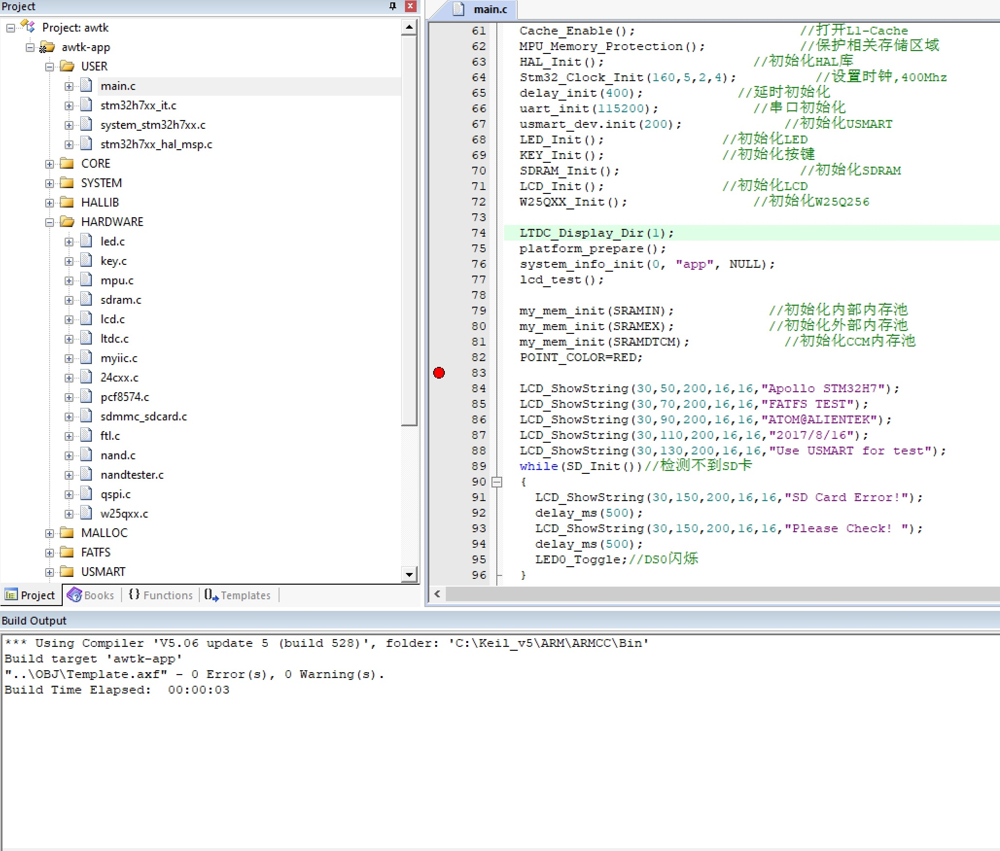

下载运行。如果开发板上出现以下界面，表示 lcd 正常工作了：

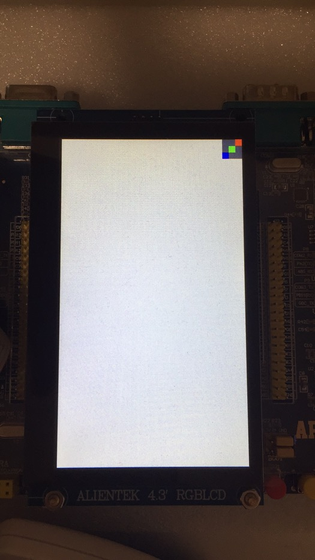

如果颜色不正常，通常是 r 和 g 通道反了，请根据具体情况，使用不同的 LCD 创建函数：

```c
#if LCD_PIXFORMAT==LCD_PIXFORMAT_ARGB8888
  lcd = lcd_mem_bgra8888_create_double_fb(w, h, s_framebuffers[0], s_framebuffers[1]);
#else
  lcd = lcd_mem_bgr565_create_double_fb(w, h, s_framebuffers[0], s_framebuffers[1]);
#endif /*LCD_PIXFORMAT*/
   
```

### 8.2 初始化 systick

systick 主要用于辅助实现定时器，底层驱动我也不熟悉， 可以参考 delay_init 实现 systick 的初始化。

> awtk-port/sys_tick.c

```c
void sys_tick_init(int SYSCLK)
{
  u32 reload=SYSCLK * 1000;
  HAL_SYSTICK_CLKSourceConfig(SYSTICK_CLKSOURCE_HCLK);
  SysTick->CTRL|=SysTick_CTRL_TICKINT_Msk;
  SysTick->LOAD=reload; 				
  SysTick->CTRL|=SysTick_CTRL_ENABLE_Msk;
}	
```

在主函数中调用 sys\_tick\_init 初始化 systick，并写个测试验证一下 systick 是否工作。

```
void sys_tick_init(int SYSCLK);	
int systick_test(void) {
  int64_t start = get_time_ms64();
  sleep_ms(1000);
  int64_t end = get_time_ms64();
  int64_t duration = end - start;
  assert(duration == 1000);
  
  return duration;
}

int main(void)
{
   u32 total,free;
  u8 t=0;	
  u8 res=0;	
  
  Cache_Enable();                	
  MPU_Memory_Protection();        
  HAL_Init();				        		
  Stm32_Clock_Init(160,5,2,4); 
  //delay_init(400);						
  uart_init(115200);						
  usmart_dev.init(200); 		
  LED_Init();								
  KEY_Init();								
  SDRAM_Init();      
  LCD_Init();								
  W25QXX_Init();				
  LTDC_Display_Dir(1);
  
  sys_tick_init(400);
  platform_prepare();
  systick_test();	
}

```

运行一下，如果没有触发 assert，说明 systick 没有问题了。如果有问题，请自行查找解决方案。

## 9. 加入应用程序及资源

现在我们来加入应用程序的代码和资源，这里我们使用 demo_ui_app.c 和 assets-1m.c，创建一个分组 awtk-app，并将下面的文件加入：

```
awtk/demos/demo_ui_app.c
awtk/demos/assets-1m.c
```

如下图所示：

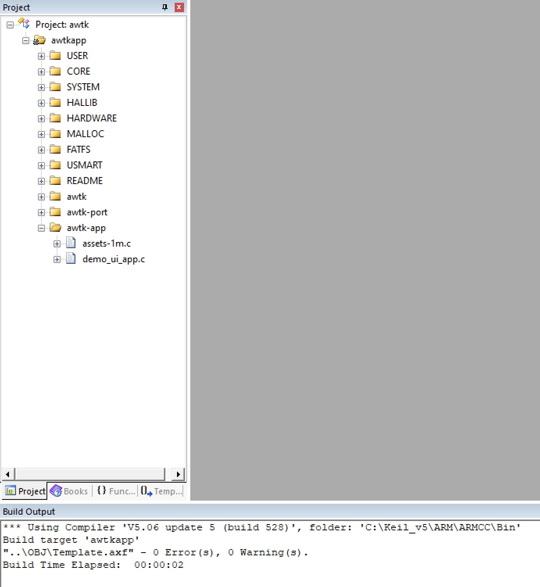

修改 main.c，调用 gui 入口函数：

```c
#include "awtk.h"

extern void sys_tick_init(int SYSCLK);
extern int gui_app_start(int lcd_w, int lcd_h);

int main(void)
{
   u32 total,free;
  u8 t=0;	
  u8 res=0;	
  
  Cache_Enable();                	
  MPU_Memory_Protection();        
  HAL_Init();				        		
  Stm32_Clock_Init(160,5,2,4); 
  //delay_init(400);						
  uart_init(115200);						
  usmart_dev.init(200); 		
  LED_Init();								
  KEY_Init();								
  SDRAM_Init();      
  LCD_Init();								
   W25QXX_Init();				
  LTDC_Display_Dir(1);
  
  sys_tick_init(400);
  
  gui_app_start(lcdltdc.width, lcdltdc.height);

  return 0;
}	
```

## 10. 问题诊断

编译运行，发现屏幕没有反应。不要惊讶，事情通常没有这么顺利的，根据以前的经验，问题有两个来源：

* 栈空间不够。
* 堆空间不够。

### 10.1 调整 Stack_Size

STM32H743 的 Stack_Size 是在文件 startup_stm32h743xx.s 中定义的，我们把它从 1K 改为 32K:

```c
; Amount of memory (in bytes) allocated for Stack
; Tailor this value to your application needs
; <h> Stack Configuration
;   <o> Stack Size (in Bytes) <0x0-0xFFFFFFFF:8>
; </h>

Stack_Size      EQU     0x00008000
```

### 10.2 调整 Heap_Size 

把 MEM1\_MAX\_SIZE 调小一点，否则全局变量不够用。

```c
//#define MEM1_MAX_SIZE			448*1024  		
#define MEM1_MAX_SIZE			100*1024  		
```

> 其它内存大小，请根据需要自行调整。

重新编译运行，显示正常了：
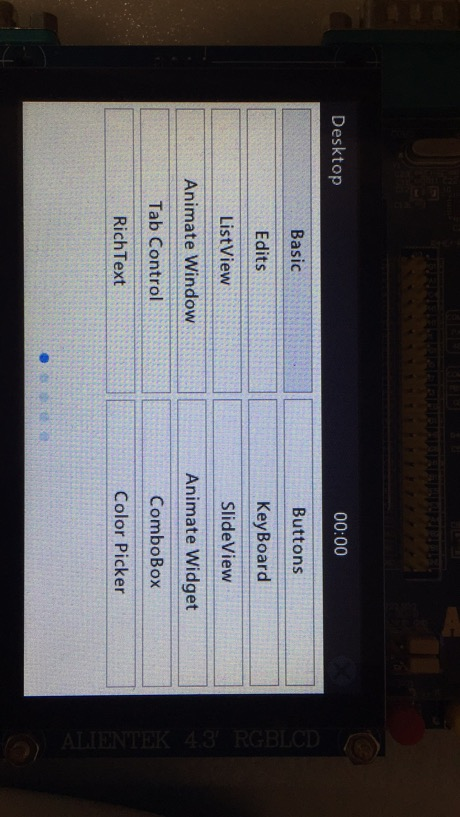

## 11. 实现输入事情

### 11.1 实现按键事件

按键事件通过 platform\_disaptch\_input 分发。这块开发板，只有 4 个按键公应用程序使用，我们把它映射到 tab、return 和 f3 几个键上，方便在没有触屏的情况下，也可实现 demoui 窗口之间的导航。

```c
#define MAX_KEYS_NR 4
static bool_t s_key_pressed[MAX_KEYS_NR];
static int s_key_map[MAX_KEYS_NR] = {
  TK_KEY_TAB,/*move focus*/
  TK_KEY_RETURN,/*activate*/
  TK_KEY_F3/*back*/
};

static ret_t platform_disaptch_key_events(main_loop_t* loop) {
  uint8_t value = KEY_Scan(0);

  if(value > 0) {
    int key = value - 1;
    s_key_pressed[key] = TRUE;
    main_loop_post_key_event(loop, TRUE, s_key_map[key]);
  } else {
    int i = 0;
    for (i = 0; i < MAX_KEYS_NR; i++) {
      if(s_key_pressed[i]) {
        s_key_pressed[i] = FALSE;
        main_loop_post_key_event(loop, FALSE, s_key_map[i]);
      }
    }
  }

  return RET_OK;
}

static ret_t platform_disaptch_input(main_loop_t* loop) {
  platform_disaptch_key_events(loop);
  
  return RET_OK;
}
```

### 11.2 实现触屏事件

从下面的例子中，我们可以拿到触摸屏的驱动代码。

```
4，程序源码、2，标准例程-HAL 库版本、实验 31 触摸屏实验、HARDWARE\TOUCH
```

我们把摸屏的驱动代码加入到项目中：

* 加入相关文件。
* 增加 include 路径。
* 调用初始化代码。

加触屏事件转换为 AWTK 的 pointer 事件：

```c
static ret_t platform_disaptch_touch_events(main_loop_t* loop) {
  int x = 0;
  int y = 0;

  tp_dev.scan(0);

  x = tp_dev.y[0];
  y = lcdltdc.height - tp_dev.x[0];

  if (tp_dev.sta & 1) {		
    if (x < lcdltdc.width && y < lcdltdc.height) {
      main_loop_post_pointer_event(loop, TRUE, x, y);
    }
  } else {
    main_loop_post_pointer_event(loop, FALSE, x, y);
  }

  return RET_OK;
}

static ret_t platform_disaptch_input(main_loop_t* loop) {
  platform_disaptch_key_events(loop);
  platform_disaptch_touch_events(loop);
  
  return RET_OK;
}
```

运行测试，发现读不到触屏事件，仔细分析后，发现是前面去掉了 delay_init，导致 delay 函数无效。

重新实现一个简化版的 delay 函数（我对底层不懂，是否正确请自行判断）：

```c
static u32 fac_us=0;					

void delay_init(u16 SYSCLK)
{
  fac_us=SYSCLK;						   
}								    

void delay_us(u32 nus)
{		
  u32 ticks;
  u32 told,tnow,tcnt=0;
  u32 reload=SysTick->LOAD;			
  ticks=nus*fac_us; 						

  told=SysTick->VAL;        				
  while(1)
  {
    tnow=SysTick->VAL;	
    if(tnow!=told)
    {	    
      if(tnow<told)tcnt+=told-tnow;	
      else tcnt+=reload-tnow+told;	    
      told=tnow;
      if(tcnt>=ticks)break;		
    }  
  };
                
}  

void delay_ms(u16 nms)
{	
  delay_us((u32)(nms*1000));		
}

```

编译运行，一切正常。

## 12. 支持 RTOS（腾讯 TinyOS)

* 加入 tencentos 相关文件。

```
..\TencentOS\arch\arm\arm-v7m\common\tos_cpu.c
..\TencentOS\arch\arm\arm-v7m\common\tos_fault.c
..\TencentOS\arch\arm\arm-v7m\cortex-m7\armcc\port_c.c
..\TencentOS\arch\arm\arm-v7m\cortex-m7\armcc\port.h
..\TencentOS\arch\arm\arm-v7m\cortex-m7\armcc\port_config.h
..\TencentOS\arch\arm\arm-v7m\cortex-m7\armcc\port_s.S
..\TencentOS\kernel\core\tos_event.c
..\TencentOS\kernel\core\tos_global.c
..\TencentOS\kernel\core\tos_mmblk.c
..\TencentOS\kernel\core\tos_mmheap.c
..\TencentOS\kernel\core\tos_mutex.c
..\TencentOS\kernel\core\tos_pend.c
..\TencentOS\kernel\core\tos_robin.c
..\TencentOS\kernel\core\tos_sched.c
..\TencentOS\kernel\core\tos_sem.c
..\TencentOS\kernel\core\tos_sys.c
..\TencentOS\kernel\core\tos_task.c
..\TencentOS\kernel\core\tos_tick.c
..\TencentOS\kernel\core\tos_time.c
..\TencentOS\kernel\core\tos_timer.c
..\TencentOS\kernel\pm\tos_pm.c
..\TencentOS\kernel\pm\tos_tickless.c
..\TencentOS\kernel\core\tos_barrier.c
..\TencentOS\kernel\core\tos_binary_heap.c
..\TencentOS\kernel\core\tos_bitmap.c
..\TencentOS\kernel\core\tos_char_fifo.c
..\TencentOS\kernel\core\tos_completion.c
..\TencentOS\kernel\core\tos_countdownlatch.c
..\TencentOS\kernel\core\tos_mail_queue.c
..\TencentOS\kernel\core\tos_message_queue.c
..\TencentOS\kernel\core\tos_priority_mail_queue.c
..\TencentOS\kernel\core\tos_priority_message_queue.c
..\TencentOS\kernel\core\tos_priority_queue.c
..\TencentOS\kernel\core\tos_ring_queue.c
..\TencentOS\kernel\core\tos_rwlock.c
..\TencentOS\kernel\core\tos_stopwatch.c
..\TencentOS\TOS-CONFIG\tos_config.h
```

* 增加包含的路径：

```
..\TencentOS\arch\arm\arm-v7m\common\include;..\TencentOS\arch\arm\arm-v7m\cortex-m7\armcc;..\TencentOS\kernel\core\include;..\TencentOS\kernel\hal\include;..\TencentOS\kernel\pm\include;..\TencentOS\TOS-CONFIG
```

* 在 stm32h7xx_it.c 中删除 PendSV_Handler

```
#if 0
/**
  * @brief  This function handles PendSVC exception.
  * @param  None
  * @retval None
  */
void PendSV_Handler(void)
{
}

#endif
```

* 移除 raw\sys_tick_handler.c、cond_var_null.c 和 mutex_null.c

* 增加下列文件到 awtk-port

```
awtk\src\platforms\raw\fs_os.c
awtk\src\platforms\tos\mutex.c
awtk\src\platforms\tos\rtos.c
awtk\src\platforms\tos\semaphore.c
awtk\src\platforms\tos\thread.c
awtk\src\platforms\common\rtos.h
awtk\src\platforms\common\sys_tick_handler.c
```

* 修改 main.c，在线程中启动 AWTK

```c
#include "tkc/thread.h"
#include "platforms/common/rtos.h"

extern void sleep_ms(int ms);
extern void sys_tick_init(int SYSCLK);
extern ret_t platform_prepare(void);
extern void systick_enable_int(void);
extern int gui_app_start(int lcd_w, int lcd_h);

void* awtk_thread(void* args) {
  gui_app_start(lcdltdc.width, lcdltdc.height);

  return NULL;
}

static ret_t awtk_start_ui_thread(void) {
  tk_thread_t* ui_thread = tk_thread_create(awtk_thread, NULL);
  return_value_if_fail(ui_thread != NULL, RET_BAD_PARAMS);

  tk_thread_set_priority(ui_thread, 3);
  tk_thread_set_name(ui_thread, "awtk");
  tk_thread_set_stack_size(ui_thread, 0xc000);

  return tk_thread_start(ui_thread);
}

int main(void)
{
   u32 total,free;
  u8 t=0;	
  u8 res=0;	
  
  Cache_Enable();                	
  MPU_Memory_Protection();        
  HAL_Init();				        		
  Stm32_Clock_Init(160,5,2,4); 
  delay_init(400);						
  uart_init(115200);						
  usmart_dev.init(200); 		
  LED_Init();								
  KEY_Init();								
  SDRAM_Init();      
  LCD_Init();								
  W25QXX_Init();				
  LTDC_Display_Dir(1);	
  sys_tick_init(400);
  
  tp_dev.init();
  
  platform_prepare();
    
  rtos_init();
  awtk_start_ui_thread();
  rtos_start();

  return 0;
}
```

编译运行，一切正常。

> GUI 线程的栈不小于 0x8000，否则可能出现莫名奇妙的错误。
> 如果要使用 gif 图像文件，GUI 线程的栈不小于 0xC000。

## 13. 加入 FATFS 访问 SD 卡

有时需要从 SD 卡加载资源，或者把数据存储到 SD 卡中，此时需要让 AWTK 支持 FATFS。awtk-fs-adapter 提供了对 FATFS。awtk 文件系统的包装，只需要把它加入进来即可。

* 下载 awtk-fs-adapter 到 awtk-stm32h743iitx-tencentos 目录

```
git clone https://github.com/zlgopen/awtk-fs-adapter.git
```

* 从工程中删除：src\platforms\raw\fs_os.c

* 加入 awtk-fs-adapter\src\fs_os_fatfs.c

* 修改 ffconf.h

```c
#define FF_FS_RPATH		2
```

* 修改 ff.h

> 如果系统提供的 FATFS 版本够新，则无需此步。

```c
typedef DIR FF_DIR;
```

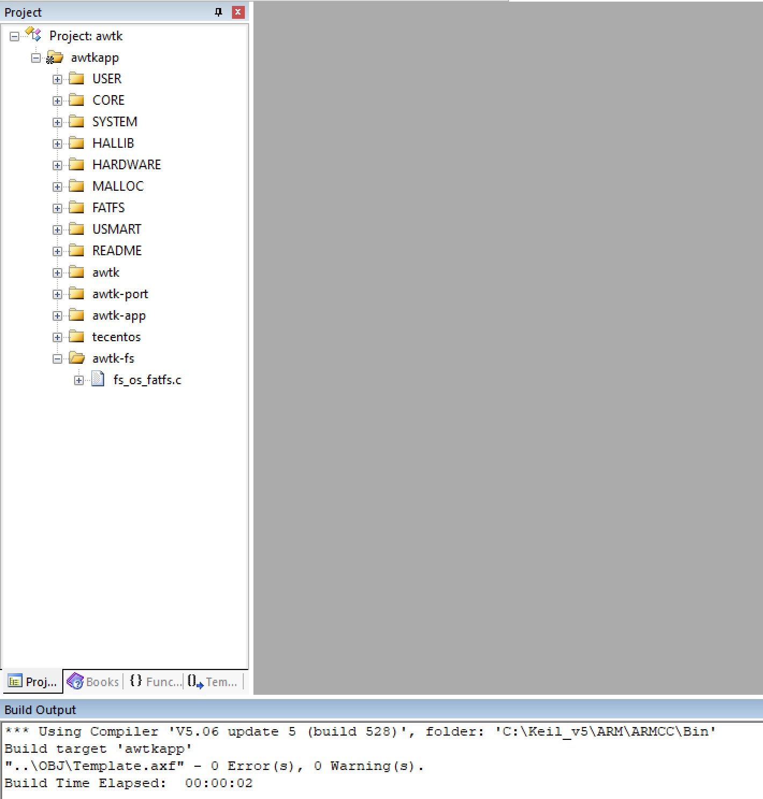

* 在 main.c 中增加一些测试：

```c
int main(void)
{
  Cache_Enable();                 
  MPU_Memory_Protection();        
  HAL_Init();                   
  Stm32_Clock_Init(160,5,2,4); 
  delay_init(400);            
  uart_init(115200);            
  usmart_dev.init(200);     
  LED_Init();               
  KEY_Init();               
  SDRAM_Init();      
  LCD_Init();               
  W25QXX_Init();        
  LTDC_Display_Dir(1);  
  sys_tick_init(400);
  
  tp_dev.init();
  
  platform_prepare();
    

  LCD_ShowString(30,130,200,16,16,"check sdcard");        
  while(SD_Init())
  {
    LCD_ShowString(30,150,200,16,16,"SD Card Error!");
    delay_ms(500);          
    LCD_ShowString(30,150,200,16,16,"Please Check! ");
    delay_ms(500);
  }
  LCD_ShowString(30,130,200,16,16,"check sdcard ok");       
  
  FTL_Init();
  exfuns_init();  
  f_mount(fs[0],"0:",1);

  fs_test(os_fs());
  
  rtos_init();
  awtk_start_ui_thread();
  rtos_start();
  
  return 0;
}

```

编译运行，测试通过。

## 14. 从 SD 卡加载资源

* 准备资源数据

用 release 脚本将资源和可执行文件拷贝到独立目录，然后将其中的 assets 目录拷贝到 SD 卡的 awtk 目录中 (release 目录）。如下图所示：

```
python scripts/release.py demoui.exe
```

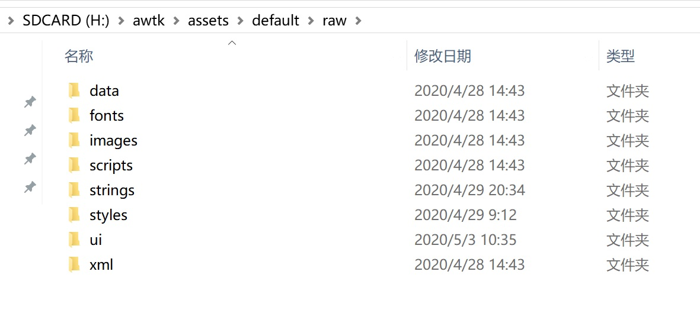

将 SD 卡弹出，并插入到开发板中。修改 main.c，加一行测试代码，重新编译运行。

```c
  f_mount(fs[0],"0:",1);
  assert(file_exist("0://awtk/assets/default/raw/fonts/default.ttf"));
```

如果没有触发 assert，表示能够正确访问资源。

* 修改配置支持从文件系统加载资源

修改 awtk-port/awtk\_config.h，定义以下几个宏：

```c
/**
 * 如果支持从文件系统加载资源，请定义本宏。
 *
 */
#define WITH_FS_RES 1

/**
 * 如果代码在 flash 中，而资源在文件系统，请定义本宏指明资源所在的路径。
 *
 */
#define APP_RES_ROOT "0://awtk/"
```

重新编译运行，我们可以发现 RO-data 有明显减少：

前（仅供参考）：
```
Program Size: Code=584346 RO-data=987002 RW-data=2152 ZI-data=34194296  
```

后（仅供参考）：
```
Program Size: Code=593450 RO-data=516062 RW-data=3444 ZI-data=34194540  
```

编译运行，一切正常（请用最新代码）。

> 如果遇到问题，请在 awtk/src/base/asset_loader_default.c 中的 load_asset 函数设置断点，看看资源有没有正确加载（确认路径是否正确）。

## 15. 支持 sqlite3

> 不需要 sqlite 的同学可跳过

* 下载基于 AWTK 移植的 sqlite3 到 awtk-stm32h743iitx-tencentos 目录

```
git clone https://github.com/zlgopen/awtk-sqlite3.git
```

* 加入下列文件 

```
awtk-sqlite3/src/sqlite3.c
awtk-sqlite3/demos/sqlite3_test.c
```

> sqlite3_test.c 用于测试基本功能是否正常。

* 增加头文件搜索路径

```
..\awtk-sqlite3\src
```

* 将测试用的数据库文件拷贝到 SD 卡/data/test.db

```
 awtk-sqlite3/data/test.db ==> /data/test.db
```

* 调用测试函数

```c
extern int sqlite3_demo(const char* db_filename);

void* awtk_thread(void* args) {
  sqlite3_demo("/data/test.db");
  
  gui_app_start(lcdltdc.width, lcdltdc.height);

  return NULL;
}

```

> 放到 RTOS 启动之后调用。

## 16. 支持中文输入法

> 要支持中文输入法，一般要支持文件系统，否则内部 flash 可能不够用。

这里以添加 google 拼音输入法为例，演示如何添加输入法。

* 增加相关文件

```
..\awtk\3rd\gpinyin\src\dictlist.cpp
..\awtk\3rd\gpinyin\src\dicttrie.cpp
..\awtk\3rd\gpinyin\src\lpicache.cpp
..\awtk\3rd\gpinyin\src\matrixsearch.cpp
..\awtk\3rd\gpinyin\src\mystdlib.cpp
..\awtk\3rd\gpinyin\src\ngram.cpp
..\awtk\3rd\gpinyin\src\pinyinime.cpp
..\awtk\3rd\gpinyin\src\searchutility.cpp
..\awtk\3rd\gpinyin\src\spellingtrie.cpp
..\awtk\3rd\gpinyin\src\splparser.cpp
..\awtk\3rd\gpinyin\src\utf16char.cpp
..\awtk\src\input_engines\input_engine_pinyin.cpp
```

* 增加头文件搜索路径

```
..\awtk\3rd\gpinyin\include
```

* 修改 awtk_config.h 中宏定义

```c
/**
* 如果不支持输入法，请定义本宏。
 * #define WITH_IME_NULL 1
 */

/**
 * 启用输入法，但不想启用联想功能，请定义本宏。
 * #define WITHOUT_SUGGEST_WORDS 1
 */

/**
* 如果支持 Google 拼音输入法，请定义本宏。
 *
 */
#define WITH_IME_PINYIN 1
```

编译一下，如果成功，可以看到 Code + RO-data 超过 1M，如果你的 flash 只有 1M，那可能会编译失败。

```
Program Size: Code=896304 RO-data=294700 RW-data=4612 ZI-data=34186956  
```

所以如果你想要启用中文输入法，最好使用有 2M 内部 flash 的板子。如果你非要使用 1M 的板子，可以尝试：

* 1. 把编译器的优先级提高一级，可以减少代码段的大小。

* 2. 修改 ffconf.h，减少常量大小。

```
//#define FF_CODE_PAGE	936
#define FF_CODE_PAGE	437
```

> 建议使用 H743，flash 大，而且速度快。

## 17. 支持 MVVM

[AWTK-MVVM](https://github.com/zlgopen/awtk-mvvm) 是一套为 AWTK 用 C 语言开发，并支持各种脚本语言的 MVVM 框架，实现了数据绑定、命令绑定和窗口导航等基本功能，使用 AWTK-MVVM 开发应用程序，无需学习 AWTK 本身的 API，只需学习绑定规则和 Model 的实现方式即可。与其它 MVVM 框架相比，其特点有：

* 代码小。
* 性能高。
* 内存开销小。
* 隔离更彻底。
* 可移植到其它 GUI。
* 支持多种编程语言（目前支持 C/JS)。

### 17.1 加入 conf_io 和 ubjson 相关文件。

```
awtk/src/conf_io/app_conf.c
awtk/src/conf_io/app_conf_init.c
awtk/src/conf_io/app_conf_init_ini.c
awtk/src/conf_io/app_conf_init_json.c
awtk/src/conf_io/app_conf_init_ubjson.c
awtk/src/conf_io/conf_ini.c
awtk/src/conf_io/conf_json.c
awtk/src/conf_io/conf_node.c
awtk/src/conf_io/conf_obj.c
awtk/src/conf_io/conf_ubjson.c

awtk/src/ubjson/ubjson_parser.c
awtk/src/ubjson/ubjson_reader.c
awtk/src/ubjson/ubjson_writer.c
```

如下图所示：

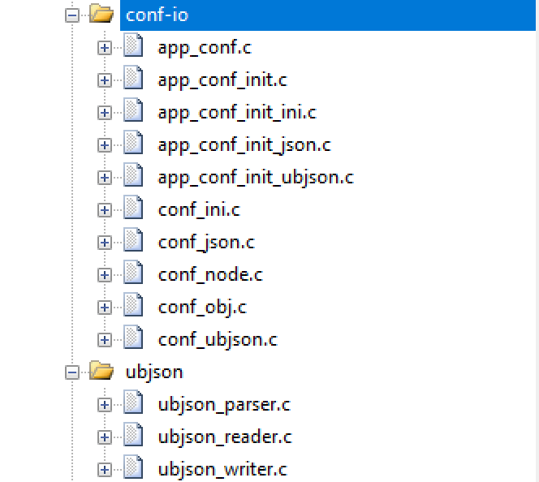

> 这个主要是用于支持 app\_conf, mvvm 对 app\_conf 提供了特殊支持，可以无代码实现配置的编辑和保存。

### 17.2 加入 awtk-mvvm 相关文件。

* 下载 mvvm 到当前目录

```
git clone https://github.com/zlgopen/awtk-mvvm.git
```

* 在项目设置中增加头文件搜索路径：

```
..\awtk-mvvm\src
```

* 加入 awtk-mvvm 相关文件

```
src/mvvm/awtk/binding_context_awtk.c
src/mvvm/awtk/mvvm_awtk.c
src/mvvm/awtk/navigator_handler_awtk.c
src/mvvm/awtk/widget_hardware.c
src/mvvm/base/binding_context.c
src/mvvm/base/binding_rule_parser.c
src/mvvm/base/command_binding.c
src/mvvm/base/data_binding.c
src/mvvm/base/mvvm_base.c
src/mvvm/base/navigator.c
src/mvvm/base/navigator_handler.c
src/mvvm/base/navigator_request.c
src/mvvm/base/utils.c
src/mvvm/base/value_converter.c
src/mvvm/base/value_converter_delegate.c
src/mvvm/base/value_validator.c
src/mvvm/base/value_validator_delegate.c
src/mvvm/base/view_model.c
src/mvvm/base/view_model_app_conf.c
src/mvvm/base/view_model_array.c
src/mvvm/base/view_model_array_dummy.c
src/mvvm/base/view_model_array_object_wrapper.c
src/mvvm/base/view_model_compositor.c
src/mvvm/base/view_model_dummy.c
src/mvvm/base/view_model_factory.c
src/mvvm/base/view_model_object_wrapper.c
src/mvvm/hardware/device_factory.c
src/mvvm/mvvm.c
```

如下图所示：

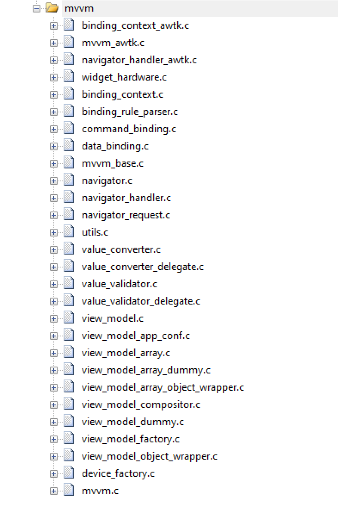

> 注意：文件可能有所变化，请根据实际情况进行调整。

### 17.3 加入 awtk-mvvm demo（或者你自己的项目）

* 加入 demo21 的源文件：

```
demos/assets.c
demos/demo21/application.c
```

如下图所示：


* 修改 awtk_config.h，增加下面的代码：

```c
#define WITH_DATA_READER_WRITER 1
```

用下面的命令把资源拷贝到发布目录：

```
 cd awtk-mvvm
 python ../awtk/scripts/release.py demo26.exe
```

> 发布工具的用法请参考： https://github.com/zlgopen/awtk/blob/master/scripts/README.md

将 release/assets 目录拷贝到 T 卡的/awtk 目录下。

编译下载运行，可以看到：

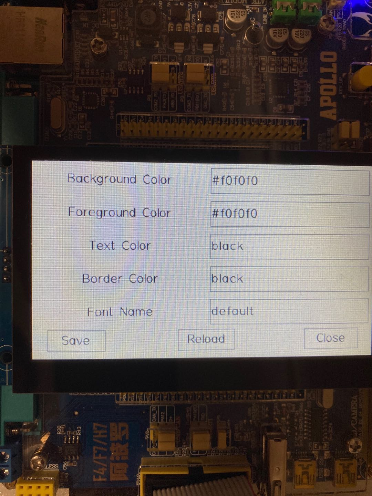

* 代码大小比较

加 mvvm 之前：

```
Program Size: Code=924144 RO-data=295332 RW-data=4636 ZI-data=34186980  
```

加 mvvm 之后：

```
Program Size: Code=943592 RO-data=296564 RW-data=4720 ZI-data=34186800  
```

加上 conf_io、ubjson 和 mvvm 后，代码段大概增加 20K。